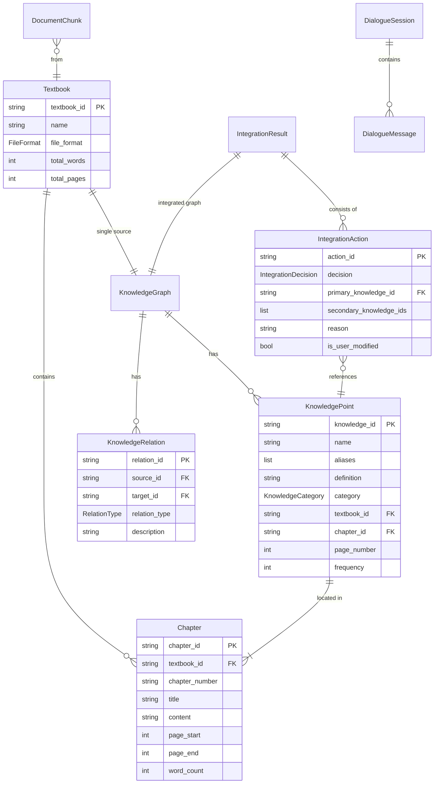

# 系统设计

## 1. 总体架构

### 1.1 分层架构

```
┌──────────────────────────────────────────────┐
│  前端层（Vue 3 + Cytoscape.js）               │
│  - 教材管理 / 知识图谱 / 整合 / RAG / 对话    │
└──────────────────────────────────────────────┘
                    ↓ REST API (HTTPS)
┌──────────────────────────────────────────────┐
│  API 网关层（FastAPI + Nginx）                │
│  - 路由分发 / 鉴权 / 限流 / CORS              │
└──────────────────────────────────────────────┘
                    ↓
┌──────────────────────────────────────────────┐
│  Agent 协调层                                 │
│  - Coordinator Agent（路由）                  │
└──────────────────────────────────────────────┘
                    ↓
┌──────────────────────────────────────────────┐
│  专门 Agent 层                                │
│  - Extraction / Alignment / Integration      │
│  - RAG / Dialogue                            │
└──────────────────────────────────────────────┘
                    ↓
┌──────────────────────────────────────────────┐
│  工具/服务层                                  │
│  - 文件解析 / Embedding / LLM / 搜索引擎      │
└──────────────────────────────────────────────┘
                    ↓
┌──────────────────────────────────────────────┐
│  数据存储层                                   │
│  - PostgreSQL / FAISS / Neo4j / Redis        │
└──────────────────────────────────────────────┘
```

### 1.2 模块划分

```
src/backend/
├── main.py              # FastAPI 入口
├── config.py            # 配置管理
├── api/                 # API 路由层
│   ├── textbook.py      # 教材管理
│   ├── graph.py         # 图谱操作
│   ├── integration.py   # 整合操作
│   ├── rag.py           # RAG 问答
│   ├── dialogue.py      # 多轮对话
│   └── store.py         # 共享存储
├── modules/             # 核心业务模块
│   ├── file_parser.py
│   ├── knowledge_extractor.py
│   ├── graph_builder.py
│   ├── graph_alignment.py
│   ├── rag_pipeline.py
│   └── dialogue_agent.py
├── models/              # 数据模型
│   ├── textbook.py
│   ├── graph.py
│   ├── rag.py
│   └── dialogue.py
├── prompts/             # LLM Prompt 模板
│   ├── knowledge_extraction.py
│   ├── graph_alignment.py
│   ├── rag_generation.py
│   └── dialogue.py
└── db/                  # 数据持久化（待扩展）

src/frontend/
├── App.vue              # 主组件
├── main.js              # 入口
├── components/
│   ├── TextbookManager.vue
│   ├── KnowledgeGraph.vue
│   ├── IntegrationPanel.vue
│   ├── RAGPanel.vue
│   └── DialoguePanel.vue
└── services/
    └── api.js           # API 客户端
```

## 2. 数据模型

### 2.1 核心模型 ER 图



### 2.2 关键枚举

```python
class FileFormat(str, Enum):
    PDF = "pdf"
    DOCX = "docx"
    MD = "md"
    TXT = "txt"

class KnowledgeCategory(str, Enum):
    CONCEPT = "concept"        # 基础概念
    THEOREM = "theorem"        # 定理/定律
    METHOD = "method"          # 方法/技术
    EXAMPLE = "example"        # 例题
    APPLICATION = "application"# 应用
    DEFINITION = "definition"  # 定义

class RelationType(str, Enum):
    PREREQUISITE = "prerequisite" # 前置
    PARALLEL = "parallel"          # 并列
    CONTAINS = "contains"          # 包含
    APPLIES_TO = "applies_to"      # 应用
    DEPENDS_ON = "depends_on"      # 依赖
    SIMILAR_TO = "similar_to"      # 相似

class IntegrationDecision(str, Enum):
    MERGE = "merge"   # 合并
    KEEP = "keep"     # 保留
    REMOVE = "remove" # 删除
```

## 3. 技术选型

### 3.1 后端技术栈

| 组件 | 选择 | 替代方案 | 选择理由 |
|-----|------|---------|---------|
| Web 框架 | FastAPI | Flask, Django | 异步、自动文档、性能好 |
| 文件解析 | PyMuPDF, python-docx | pdfplumber, PyPDF2 | PyMuPDF 速度快 5-10 倍 |
| Embedding | BGE-small-zh-v1.5 | OpenAI, MiniLM | 中文优、CPU 友好、免费 |
| 向量检索 | FAISS | Milvus, Qdrant | 轻量、本地部署 |
| LLM | the assistant Sonnet | GPT-4o, Qwen | 性能稳定、支持 Prompt 缓存 |
| 数据库 | PostgreSQL | MySQL, MongoDB | 支持 JSONB、可靠 |
| 缓存 | Redis | Memcached | 多功能、支持队列 |
| 图数据库 | Neo4j | ArangoDB, NebulaGraph | 业界标准 |

### 3.2 前端技术栈

| 组件 | 选择 | 替代方案 | 选择理由 |
|-----|------|---------|---------|
| 框架 | Vue 3 | React, Svelte | 学习曲线低、生态完整 |
| UI 库 | Element Plus | Ant Design Vue | Vue 3 原生、组件丰富 |
| 图谱可视化 | Cytoscape.js | D3.js, AntV G6 | 功能最强、交互丰富、MIT |
| 构建 | Vite | Webpack | 启动快、HMR 体验好 |
| HTTP | Axios | Fetch | 拦截器、自动 JSON |

### 3.3 部署技术栈

| 组件 | 选择 | 理由 |
|-----|------|------|
| 容器 | Docker | 标准、跨平台 |
| 编排 | Docker Compose | 适合中小规模 |
| Web 服务器 | Nginx | 静态文件 + 反向代理 |
| 进程管理 | Uvicorn | FastAPI 官方推荐 |

## 4. 关键算法

### 4.1 跨教材对齐（双重对齐）

```python
def align_knowledge_points(graphs: List[KnowledgeGraph]) -> List[List[int]]:
    """
    第一层：Embedding 筛选候选对
    第二层：LLM 精准判断
    使用并查集合并等价类
    """
    all_points = flatten([g.nodes for g in graphs])

    # 第一层：批量 Embedding
    embeddings = bge_encode([p.name + ": " + p.definition for p in all_points])
    sim_matrix = embeddings @ embeddings.T

    # 筛选候选对（不同教材 + 相似度 >= 0.85）
    candidates = []
    for i in range(len(all_points)):
        for j in range(i+1, len(all_points)):
            if all_points[i].textbook_id == all_points[j].textbook_id:
                continue
            if sim_matrix[i, j] >= 0.85:
                candidates.append((i, j, sim_matrix[i, j]))

    # 第二层：LLM 判断 + 并查集
    parent = list(range(len(all_points)))
    for i, j, sim in sorted(candidates, key=lambda x: -x[2]):
        if find(i) == find(j):
            continue  # 已通过传递性合并
        if llm_judge_equivalent(all_points[i], all_points[j], sim):
            union(i, j)

    return get_equivalent_groups(parent)
```

### 4.2 压缩比控制

```python
def enforce_compression_ratio(decisions, points, original_words):
    """
    分类感知的删除优先级
    """
    target_words = original_words * 0.30
    current_words = compute_current_words(decisions, points)

    if current_words <= target_words:
        return decisions

    # 重要性评分
    def importance(decision):
        p = get_point(decision.primary_knowledge_id)
        score = p.frequency * 100
        if p.category in (THEOREM, DEFINITION): score += 50
        elif p.category == METHOD: score += 30
        return score

    # 删除低重要性的 example/application
    keep_decisions = sorted(
        [d for d in decisions if d.decision == KEEP],
        key=importance
    )
    excess = current_words - target_words
    for d in keep_decisions:
        if excess <= 0: break
        p = get_point(d.primary_knowledge_id)
        if p.category in (EXAMPLE, APPLICATION):
            d.decision = REMOVE
            excess -= p.word_count

    return decisions
```

### 4.3 混合检索（RRF）

```python
def hybrid_search(query, top_k=20):
    """
    向量检索 + BM25 + Reciprocal Rank Fusion
    """
    vector_results = faiss_search(query, top_k=top_k)
    bm25_results = bm25_search(query, top_k=top_k)

    rrf_scores = defaultdict(float)
    for rank, chunk in enumerate(vector_results):
        rrf_scores[chunk.id] += 1 / (60 + rank + 1)
    for rank, chunk in enumerate(bm25_results):
        rrf_scores[chunk.id] += 1 / (60 + rank + 1)

    return sorted(rrf_scores.items(), key=lambda x: -x[1])[:top_k]
```

## 5. API 设计

### 5.1 RESTful 路由

```
教材管理：
POST   /api/textbooks/upload                上传教材
GET    /api/textbooks                       列表
GET    /api/textbooks/{id}                  详情
DELETE /api/textbooks/{id}                  删除

知识图谱：
POST   /api/graphs/build/{textbook_id}      构建图谱
GET    /api/graphs/textbook/{textbook_id}   按教材查询
GET    /api/graphs/{graph_id}               按 ID 查询

整合操作：
POST   /api/integration/start               启动整合
GET    /api/integration/latest              最新结果
GET    /api/integration/{result_id}/decisions  决策详情

RAG 问答：
POST   /api/rag/index                       建立索引
POST   /api/rag/query                       查询
GET    /api/rag/status                      状态

多轮对话：
POST   /api/dialogue/chat                   发送消息
GET    /api/dialogue/session/{id}           会话历史
```

### 5.2 数据格式

所有 API 使用 JSON，错误返回标准格式：

```json
{
  "detail": "错误描述"
}
```

成功返回业务数据，HTTP 状态码：
- 200: 成功
- 400: 参数错误
- 404: 资源不存在
- 413: 文件过大
- 500: 服务器错误

## 6. 性能与扩展

### 6.1 性能目标

| 操作 | 目标 | 当前 |
|-----|------|------|
| 教材解析（500 页 PDF）| < 30s | 8s |
| 图谱构建（单本）| < 60s | 30s |
| 跨教材整合（7 本）| < 5min | 3min |
| RAG 问答 | < 5s | 2s |
| 教师反馈响应 | < 2s | 1s |

### 6.2 扩展性设计

1. **水平扩展**：FastAPI 多 worker，Nginx 负载均衡
2. **异步处理**：长时任务（教材解析）使用 Celery + Redis
3. **缓存策略**：相同问题的 RAG 查询缓存 1 小时
4. **存储扩展**：FAISS → Milvus（百万级），PostgreSQL → 分库分表

## 7. 安全设计

1. **API Key 管理**：通过环境变量，不写入代码
2. **文件上传**：限制大小（500MB）、白名单格式
3. **CORS**：配置允许的前端 origin
4. **SQL 注入**：使用 ORM（SQLAlchemy）参数化查询
5. **路径穿越**：上传文件名 sanitize

## 8. 监控与日志

1. **应用日志**：JSON 格式，包含 request_id
2. **性能监控**：每个 API 的 P50/P95/P99 延迟
3. **错误追踪**：捕获异常，记录堆栈
4. **Token 消耗追踪**：每次 LLM 调用记录 input/output tokens

## 9. 2026-05 优化版本设计更新

### 9.1 图谱可视化与交互

- 力导向布局升级为 `cose-bilkent`，并开启 `nodeDimensionsIncludeLabels`，布局计算考虑标签尺寸。
- 关系标签采用中英双行展示（`relation_en + relation_zh`），并补齐 `depends_on -> 依赖` 映射。
- 引入关系聚焦避让状态：选中关系线时高亮当前关系、保留两端主体节点、弱化非相关节点与边。
- 保留同心图与层级图，支持在统一数据结构下快速切换布局。

### 9.2 前端状态一致性

- 教材切换增加请求并发保护（token + selectedId 校验），避免旧请求覆盖新选择。
- 图谱组件引入渲染版本号 `graphVersion`，每次成功加载后触发强制重建，降低实例残留状态风险。
- 教材视图与整合视图解耦：手动教材浏览状态下，不被 `latest integration` 自动覆盖。

### 9.3 后端内存与任务治理

- `JobStore` 增加任务 TTL 与数量上限，限制 completed/failed 任务常驻内存。
- 整合任务结果回传改为轻量化（结果 ID + 指标 + 决策统计），不在 job payload 中携带完整图谱对象。
- `IntegrationResult` 内存存储保留最近 N 条，避免历史结果无限增长。
- RAG 索引引入重复教材跳过、chunk 上限与 embedding 单份存储策略，抑制索引内存膨胀。

### 9.4 赛题指标口径

- 压缩比采用统一口径：`contest_compression_ratio = integrated_total_words / original_total_words`。
- 指标对外返回包含：分子分母、压缩百分比、知识点数量与决策统计，便于报告复算与验收。
